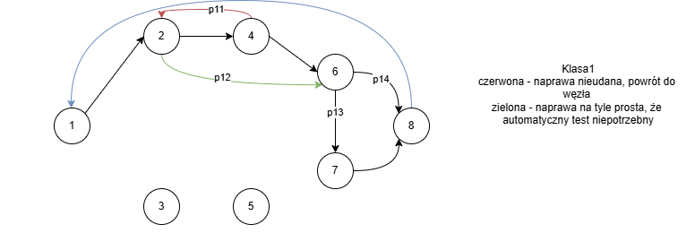
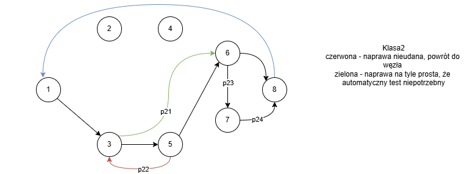
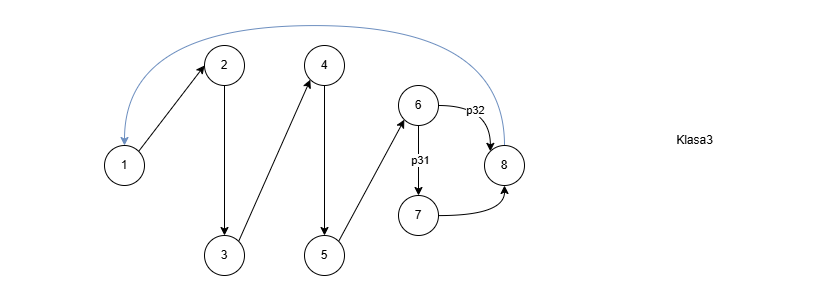
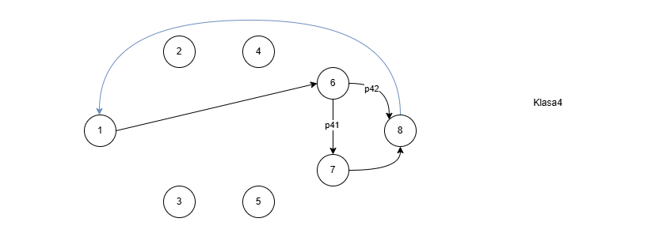

# Workshop-Chain-Queueing-Theory

## Struktura sieci kolejkowej (BCMP – zamknięta)

Poniższa sieć modeluje system serwisowy urządzeń elektryczno–mechanicznych z czterema klasami zleceń. Sieć jest typu **BCMP**, zamknięta, z ośmioma węzłami różnego typu.

### **Węzły sieci**

| l.p. | Nazwa węzła                         | Typ węzła |
|------|--------------------------------------|-----------|
| 1    | Przyjmowanie zgłoszenia              | 1 (FIFO)  |
| 2    | Dział elektryczny (naprawa)          | 1 (FIFO)  |
| 3    | Dział mechaniczny (naprawa)          | 1 (FIFO)  |
| 4    | Testy elektryczne – automatyczne     | 3 (IS)    |
| 5    | Testy mechaniczne – automatyczne     | 3 (IS)    |
| 6    | Wycena / dokumentacja                | 1 (FIFO)  |
| 7    | Obsługa klienta – wydanie urządzenia | 3 (IS)    |
| 8    | Stała eksploatacja                   | 3 (IS)    |

---

### **Marszruty dla klas klientów**

#### **Klasa 1 – Uszkodzenia elektryczne**

#### **Klasa 2 – Uszkodzenia mechaniczne**

#### **Klasa 3 – Uszkodzenia mieszane (elektryczno–mechaniczne)**

#### **Klasa 4 – Uproszczone zlecenia**
